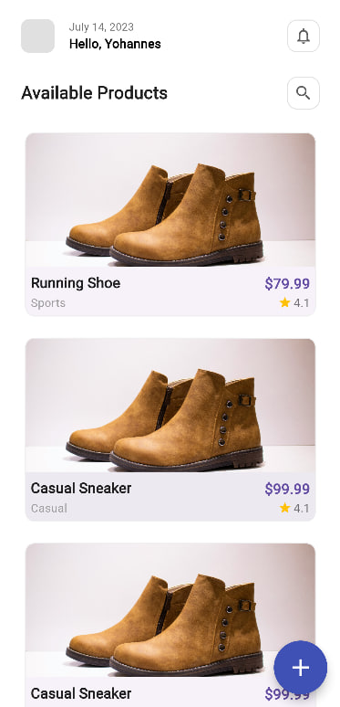
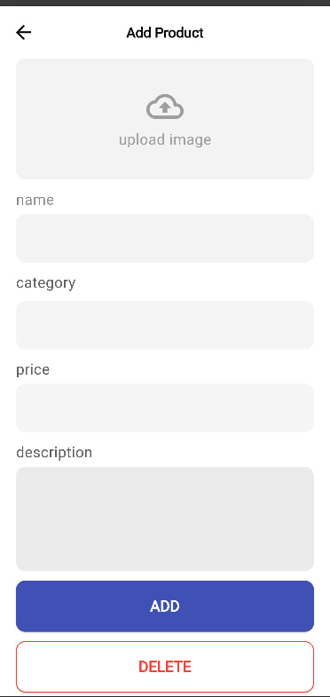
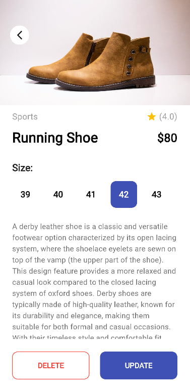
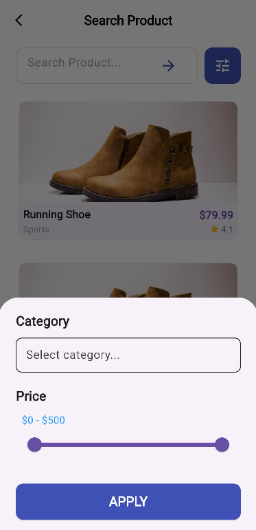

# Flutter E-Commerce Mobile App

## 📱 Project Overview

A Flutter e-commerce application that implements product management with UI design replication and comprehensive navigation features. This project completes Task 6 and Task 7 as part of mobile development A2SV assignments.

---

## 📋 Tasks Implementation

### **Submission — Task 6: Flutter User Interface Implementation**

This README documents the submission for Task 6. The screenshots below illustrate the app UI and key features implemented for this task.

**Features Implemented:**

- Replicated provided Figma design with pixel-perfect accuracy
- Implemented consistent design system with proper spacing, typography, and colors
- Utilized appropriate Flutter widgets: Container, Column, Row, Image, Text, Button
- Designed responsive layouts for different screen sizes
- Created custom UI components matching the design reference

**Screenshots:**

|  |  |  |  |
| :--------------------------------------------: | :-----------------------------------------------: | :--------------------------------------------: | :-----------------------------------------------------: |
|                 _Home Screen _                 |             _Product Detail Screen _              |              _Add Product Screen_              |                     _Search Screen_                     |

---

### **Submission — Task 7: Navigation and Routing Implementation**

Task 7 implements app routing using named routes and demonstrates passing data between screens in the e-commerce application.

**Features Implemented:**

- **Named Routes**: Configured named routes in MaterialApp with proper route hierarchy
- **Screen Navigation**: Implemented three main screens (Home, Add/Edit, Detail) with seamless navigation
- **Data Passing**: Successfully pass product data from Add/Edit screens back to Home screen
- **Navigation Animations**: Custom page transitions with smooth animations between screens
- **Back Button Handling**: Proper navigation stack management and back button functionality
